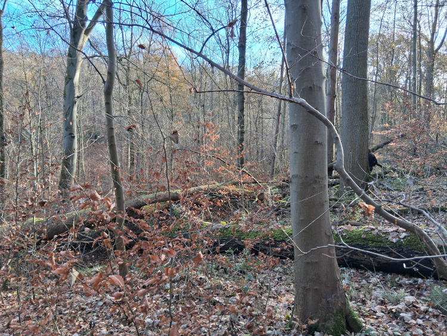

  
  
Crédit photo : Madeline Mahieu. Bois de Lauzelle, Belgique

Lisein J 2025-12

A repository to share internally and with external collaborators data and processing workflow regarding the characterization of old growth forest in Wallonia.

Especially usefull for tracking and sharing the changes in the R script.

## 🚧 Structure

.
├── data
│   ├── OGF_all.db 				-> sqlite database with all forest plot measurement and dendrometric results
│   └── ogf_gnss.gpkg				-> geopackage spatial layers, one with the position of tree with circunference larger than 240 cm (or dominant tree) 
├── documentation
│   ├── description_table_OGF.txt		-> meta data for the tables in OGF_all.db
│   ├── methodo.txt				-> description of the field methodology
│   └── notes.txt				-> to do list and others anotations
├── output
├── README.md
└── scripts
    ├── OGF_plots_processing.R		-> script module to compute dendrometric variables from raw measurements
    ├── OGF_remoteSensing.R			-> script to compare field measurement with remote sensing data (LiDAR tree segmentation, LiDAR+Sentinel2 predicted CNN dendrometric variables 
    └── utils_OGF.R				-> custom function used in OGF_plots_processing.R

## Methodology

  
  
Quick view of the field methodology for the scientific measurement of forest plot in potential Old Growth Forest

